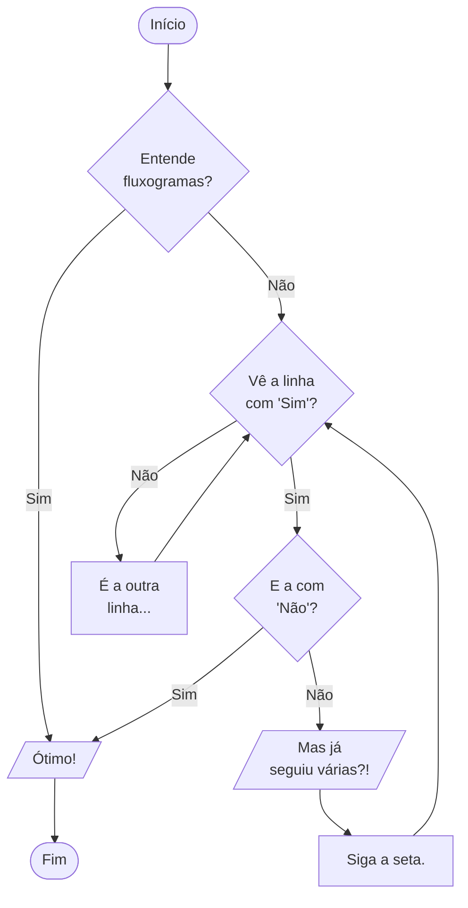
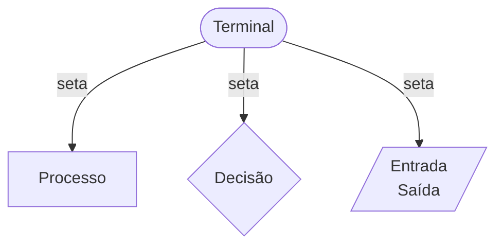

## Fluxograma

Outro jeito bastante intuitivo com o uso de figuras geométricas, como pode ser vista nos diagramas abaixo.

Cada forma geométrica tem um significado especifico mas, para facilitar, usaremos apenas as a seguir:

* Terminal: que indica onde o algoritmo inicia e onde termina.
* Dado(s): que indica a comunicação (entrada/saída) de dado(s) com o algoritmo.
* Processo: que indica a execução de uma instrução/tarefa.
* Decisão: que indica a necessidade de se escolher uma (e apenas uma!) das diversas possíveis ações subsequentes.
* Seta: que indica a sequência em que as instruções serão executadas.

Geralmente se usa instruções mais diretas e simples que na descrição narrativa, também em função da limitação das figuras utilizadas. Isso tem dois efeitos muito interessantes: o uso de fluxograma restringe muito a amplitude do entendimento das instruções, facilitando a construção de instruções bem definidas para o algoritmo; mas também restringe o tipo de instruções utilizáveis, dificultando a construção do processo desejado - podem ser necessárias mais instruções para descrever adequadamente um pedaço mais complexo do comportamento.

