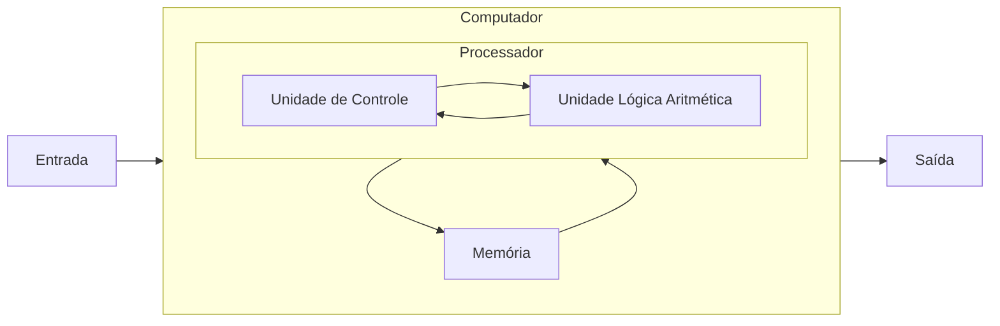

# Computadores

!!! quote "[Joe Sondow](https://www.linkedin.com/in/joesondow)"

    *Um computador é como um gênio travesso. Te dá exatamente o que você pede dele, mas nem sempre o que você quer.*

A humanidade é engenhosa, e sempre buscou criar e aprimorar ferramentas para auxiliar nas realização de tarefas. Assim como o fogo e a roda, o computador é uma ferramenta que revolucionou o mundo, e hoje em dia é difícil encontrar algum tipo de atividade que não seja (ou possa ser) auxiliada por esta máquina que substituiu pessoas no esforço de processar dados e transformá-los em resultados. A [história da computação](https://pt.wikipedia.org/wiki/Hist%C3%B3ria_da_computa%C3%A7%C3%A3o) é antiga e está entrelaçada com as histórias dos [números](http://pt.wikipedia.org/wiki/N%C3%BAmero#Hist.C3.B3ria_dos_n.C3.BAmeros), do [hardware](http://pt.wikipedia.org/wiki/Hardware#Hist.C3.B3ria_do_Hardware), de [algoritmos](http://pt.wikipedia.org/wiki/Algoritmo) e [lógica](http://pt.wikipedia.org/wiki/L%C3%B3gica_matem%C3%A1tica), e da [programação](http://pt.wikipedia.org/wiki/Linguagem_de_programa%C3%A7%C3%A3o#Hist.C3.B3ria)

De forma simplificada, um computador é uma máquina que:

1. realiza cálculos [simples] rapidamente;
1. lembra de [muitos] resultados.

Um "cálculo" é a execução de uma operação primitiva pela máquina, e um "resultado" é uma informação resultante desta operação ou já conhecida. A *computação*, portanto, lida basicamente com dois elementos, as informações sendo manipuladas (*dados*) e as regras de manipulação delas (*procedimentos*)[@Abelson1996]. São tantas as aplicações e possibilidades que criou-se uma nova área de conhecimento: a *Ciência da Computação*, que estuda a fundamentação teórica das construções computacionais, bem como suas aplicações em dispositivos tecnológicos e sistemas de computação[@SBC2005].

A computação é muito abrangente, envolvendo diversas outras (lógica, matemática, etc.) e, apesar de não ser necessariamente focada nela, está intrinsecamente associada a uma ferramenta: *o computador*. Ao descrever soluções como procedimentos que manipulam (corretamente) dados, pode-se usar esta máquina para resolver inúmeros problemas.

A aplicação do pensamento computacional resulta em soluções representadas como etapas computacionais e algoritmos para execução pelo computador, focando nos dois elementos básicos: conhecimento *descritivo* (o que?) e, principalmente, *procedural* (como?). Por exemplo, resolver o problema "qual a raiz quadrada de um número $n$?" a solução deve definir um processo que encontre um valor $r$ tal que $r^2 = n$, que é um conhecimento descritivo. Uma abordagem é o método babilônico:

``` linguagem-natural title="Método Babilônico"
Inicie com um número positivo arbitrário r
Enquanto r² não for suficientemente próximo a n:
    Atualize o valor de r para a média entre r e n/r.
```

Considerando $n = 144$, uma estimativa inicial $r = 1$ e que "suficientemente próximo" signifique que $|n - r^2| \leq 0,5$, a aplicação das instruções acima resultam na construção da seguinte sequência de valores para $r$: 1, 72,5, 37,24, 20,55, 13,8 e, finalmente, 12,1. Uma descrição mais precisa destes algoritmo permite que o computador realize este processo mecânico para chegar à solução desejada. Para lidar com problemas diferentes, basta fornecer grupos diferentes de instruções!

!!! warning

    O computador interpreta as instruções no sentido de recebê-las em uma representação específica e traduzi-las em sua operações primitivas para execução, não no sentido de dar-lhes sentido para obter o resultado desejado. *Ele faz o que você manda, não o que você quer*.

Entender mais sobre esta máquina e como ela funciona é essencial para usá-la na resolução de problemas. O computador, além de processar e armazenar os dados, também precisa movimentá-los entre os dispositivos e controlar toda essa manipulação. Para tanto, é preciso que diversos componentes elétricos, eletrônicos e eletromecânicos (hardware) trabalhem em conjunto para realizar os processos definidos no algoritmo (software).

## Arquitetura de Computadores

A arquitetura do computador busca projetar a máquina de tal forma a maximizar desempenho e eficiência energética dentro das restrições de custo, potência e disponibilidade existentes[@Hennessy2011]. A função principal do computador é realizar as computações, ou seja, processar os dados. Isso é feito com as operações básicas de lógica e aritmética que são construídas na máquina. Para viabilizar estas operações, é preciso armazenar os dados, movê-los entre os dispositivos de armazenagem e processamento e gerenciar esta movimentação com o processamento.

Na arquitetura mais comum, as instruções são vistas como informações que armazenadas, ou seja, conhecimento descritivo, e são tratadas como dados que o computador processa. Este modelo de "computador de programa armazenado", em que as instruções e os dados existem em um mesmo meio físico, é conhecido como Arquitetura de von Neumann[@Godfrey1993], e é a forma mais comum dos computadores modernos. Nela, a solução de um problema é obtida por um ciclo de execução simples: *busca* (a próxima instrução), *decodificação* (em instruções primitivas) e *execução* (das primitivas realizando a computação).



Este modelo representa os principais componentes necessários para o processo de ler a instrução, interpretá-la e executá-la. A memória armazena as instruções (conhecimento procedural) e os resultados intermediários (conhecimento descritivo). Novos dados podem ser fornecidos ao computador por algum dispositivo de *entrada* ou obtidos dele por um dispositivo de *saída*. O processador gerencia quais instruções devem ser realizadas e suas execuções, além de movimentar as informações entre os componentes. Para isso, tem dispositivos que realizam operações de aritmética e lógica, testes simples, e manipulação de dados.

A implementação física deste modelo necessita de uma parte física que realiza a tarefa, e de uma parte lógica que define como realizá-la. Apesar de nos preocuparmos mais com a parte lógica neste livro, ambas são essenciais para o bom funcionamento.

## Hardware

O hardware é um conjunto de componentes e equipamentos que compõem um sistema computacional, que seguem a arquitetura von Neumann. Os componentes físicos têm diferentes propósitos.

[](https://commons.wikimedia.org/wiki/File:Personal_computer,_exploded_5.svg)

<style type="text/css">
    .circled {
        border-radius: 75%;
        border: 2px solid;
        text-align: center;
        padding: 5px;
    }
</style>
* <span class="circled">&nbsp;3&nbsp;</span>, **Unidade Central de Processamento** (UCP) é o dispositivo que interpreta e executa e instruções, lê e escreve a memória. Seus componentes básicos são a [UC](http://pt.wikipedia.org/wiki/Unidade_de_controle) (que determina quais operações serão realizadas e em que ordem) e a [ULA](http://pt.wikipedia.org/wiki/Unidade_l\%C3\%B3gica_e_aritm\%C3\%A9tica) (que realiza operações aritméticas e lógicas). Os [registradores](http://pt.wikipedia.org/wiki/Registrador_%28inform%C3%A1tica%29), que armazenam os dados sendo processados no momento, também podem ser considerado parte da UCP, mas são conceitualmente parte da memória. O desempenho da UCP era ligado a sua [velocidade](http://pt.wikipedia.org/wiki/Frequ%C3%AAncia_de_rel%C3%B3gio), mas [certos limites](http://pt.wikipedia.org/wiki/Lei_de_Moore) já foram alcançados e, atualmente, os esforços são direcionados a outras formas de melhoria.
* <span class="circled">&nbsp;4&nbsp;</span>, <span class="circled">&nbsp;8&nbsp;</span> **memória** é o dispositivo que permite armazenar dados em um conjunto ordenado de *bits*. A armazenagem pode ser *volátil* (perde seus dados com ausência de energia) ou *não voláteis*. Além disso, há certa [hierarquia](http://pt.wikipedia.org/wiki/Hierarquia_de_mem%C3%B3ria) de tipos, pois o custo é inversamente proporcional a velocidade de acesso. A chamada *memória principal* contém os dados sendo manipulados na tarefa em execução (na memória volátil), portanto é mais rápida e intermedia o acesso aos dados da *memória secundária*. Esta serve para armazenamento permanente de dados, tem maior capacidade mas desempenho inferior. A característica mais interessante da memória principal é o [*acesso aleatório*](http://pt.wikipedia.org/wiki/Acesso_aleat%C3%B3rio), em que posições específicas de memória são acessadas diretamente, utilizando uma lógica de endereçamento. Isto, e a velocidade do acesso, contrastam com a memória secundária.
* <span class="circled">&nbsp;1&nbsp;</span>, <span class="circled">&nbsp;7&nbsp;</span>, <span class="circled">&nbsp;9&nbsp;</span> e <span class="circled">10</span> **Entrada/Saída** os dispositivos de entrada e saída de dados (E/S ou I/O) permitem a comunicação com o computador, de modo que ele possa receber dados para realizar uma tarefa, e fornecer os resultados desta. Existem diversas formas de transmitir os dados:

    * Entrada: teclado, mouse, microfone, scanner, leitor de código de barras, câmera, joystick, etc.;
    * Saída: monitor, caixas de som, impressora, etc.;
    * E/S: disco rígido, monitor sensível a toques, pendrive, etc.

Além destes componentes "básicos" da arquitetura von Neumann, diversos outros são necessários.

* <span class="circled">&nbsp;2&nbsp;</span>, **placa mãe** [conecta os componentes do computador](http://pt.wikipedia.org/wiki/Placa-m%C3%A3e) de modo que possam funcionar em conjunto, possibilitando a comunicação entre eles e a distribuição de energia.
* <span class="circled">&nbsp;5&nbsp;</span>, **placas de expansão** que possibilitam o [uso de outros componentes periféricos](https://pt.wikipedia.org/wiki/Placa_de_expans%C3%A3o), ampliando as aplicações.
* <span class="circled">&nbsp;6&nbsp;</span>, **fonte de alimentação** que [regula a distribuição de energia](http://pt.wikipedia.org/wiki/Fonte_de_alimenta%C3%A7%C3%A3o) para os componentes.
* **barramento** é o [sistema de comunicação](http://pt.wikipedia.org/wiki/Barramento) que transfere dados entre os componentes do computador. A taxa de transferência do barramento é o que define seu desempenho. Barramentos: processador, cache, memória, dispositivos de entrada/saída, dados.
* **mainFrame/supercomputador** [são computadores](http://pt.wikipedia.org/wiki/Supercomputador) [grande porte](http://pt.wikipedia.org/wiki/Mainframe), geralmente dedicados a aplicações específicas que demandam o processamento de grandes volumes de informação.
* **a "nuvem"** é o uso de [computadores e servidores compartilhados e interligados por meio da Internet](http://pt.wikipedia.org/wiki/Computa%C3%A7%C3%A3o_em_nuvem), seguindo o princípio da [computação em grade](http://pt.wikipedia.org/wiki/Computa%C3%A7%C3%A3o_em_grelha).

O funcionamento de um computador ocorre pela manipulação e comunicação de sinais elétricos entre seus componentes, como um processo físico, sendo os sinais mais simples são os sinais "ligado" e "desligado"[@Patterson1998]. Esse estado binário de um sinal pode ser representado por um *binary digit* (um bit), um valor que pode ser um de dois estados distintos e mutuamente exclusivos[@Tenenbaum1995]:<code>0</code> (desligado) ou <code>1</code> (ligado). Os conjuntos de bits determinam as informações armazenadas, inclusive os programas que determinam o que a máquina deve fazer.

## Software

O software é a parte lógica do sistema computacional, que define quais instruções devem ser executadas pelo hardware. Pode ser dividido em dois tipos, *programas de sistema* que possibilitam a interação com o hardware (computador e periféricos) e fornecem uma plataforma para execução das *aplicações*, que realizam tarefas mais específicas como edição de documentos, organização de dados, entretenimento, educacional, manipulação de mídia, e outros.

<h3>Programas de Sistema</h3>

O *[sistema operacional](http://pt.wikipedia.org/wiki/Sistema_operativo)* é o conjunto de programas que gerencia o hardware e fornece serviços comuns às aplicações. Podem ser de [tempo-real](http://pt.wikipedia.org/wiki/Tempo_real), [multi-usuário](http://pt.wikipedia.org/wiki/Multiusu%C3%A1rio), [multi-tarefas](http://pt.wikipedia.org/wiki/Multitarefa), [embarcado](http://pt.wikipedia.org/wiki/Sistema_embarcado), entre outros. Possibilita a comunicação com os componentes de [núcleo](https://pt.wikipedia.org/wiki/N%C3%BAcleo_(sistema_operacional)), que controla execução, interrupções, gerenciamento de memória [virtual], acesso a disco e arquivos, comunicação com dispositivos, etc., bem como de comunicação, segurança, interface gráfica, entre outros.

Os sistemas mais conhecidos são: Unix ([BSD](http://www.bsd.org/), [GNU-Linux](http://www.gnu.org/gnu/linux-and-gnu.pt-br.html), [OS X](https://www.apple.com/br/osx/)), [Microsoft Windows](http://windows.microsoft.com/pt-br/windows/home), [Plan 9](http://plan9.bell-labs.com/plan9/), [Android](https://www.android.com/), etc. É possível ter uma ideia da utilização de cada sistema por sua [fatia de mercado](https://gs.statcounter.com/os-market-share/desktop/worldwide). Atualmente, o Windows domina o mercado de desktops, e o de dispositivos móveis é dividido entre Android e iOS. Mas a [computação de alto desempenho é praticamente toda em Unix](https://www.top500.org).

Os *utilitários* são os programas que auxiliam a analisar e configurar o computador, como análise/manutenção de disco, análise de memória, anti-vírus, armazenamento de dados, cifragem, compressão, conectividade com a rede, cópia de segurança, gerenciador de arquivos, monitoração do processador, sincronização de dados/arquivos, entre muitos outros. Alguns exemplos são análise/manutenção de disco, análise de memória, anti-vírus, armazenamento de dados, cifragem, compressão, conectividade com a rede, cópia de segurança, gerenciador de arquivos, monitoração do processador, sincronização de dados/arquivos.

Os *controladores de dispositivos*, também conhecidos como *[drivers](http://pt.wikipedia.org/wiki/Driver_de_dispositivo)* de dispositivos, são os programas que gerenciam um hardware específico do computador, como barramento, impressora, máquinas digitais, placa de rede/áudio/vídeo/aquisição de sinais, scanner, smartphones, etc.

As *interfaces com usuário* são programas que interagem com o usuário, geralmente divididos em função do uso via [linha de comando](http://pt.wikipedia.org/wiki/Interpretador_de_comandos) ou [interface gráfica](http://pt.wikipedia.org/wiki/Interface_gr%C3%A1fica_do_utilizador).

Os programas de *desenvolvimento* auxiliam o desenvolvimento de programas, como [compiladores](http://pt.wikipedia.org/wiki/Compilador), [interpretadores](http://pt.wikipedia.org/wiki/Interpretador), [IDEs](http://pt.wikipedia.org/wiki/Ambiente_de_desenvolvimento_integrado), [montadores](http://pt.wikipedia.org/wiki/Assembly#Montador), [depuradores](http://pt.wikipedia.org/wiki/Depurador), etc.

<h3>Aplicações</h3>

São os programas com fins específicos, como [navegadores](http://pt.wikipedia.org/wiki/Navegador_%28inform%C3%A1tica%29), [programa para escritório](http://pt.wikipedia.org/wiki/Su%C3%ADte_de_escrit%C3%B3rio), [entretenimento](http://pt.wikipedia.org/wiki/Jogo_de_computador), e muitos, muitos mais.


<h2>Exercícios</h2>

??? question "Descreva os componentes físicos de um computador e suas funcionalidades."

    A unidade central de processamento é o dispositivo que interpreta e executa e instruções, lê e escreve a memória, tendo como parte integrante os registradores que armazenam os dados sendo processados no momento. Memória permite armazenar dados em um conjunto ordenado de *bits*.

    Os dispositivos de entrada e saída de dados permitem que humanos e outras máquinas se comunicação com o computador. Exemplos de dispositivos de entrada são: teclado, mouse, microfone, scanner, leitor de código de barras, câmera, joystick, etc. Exemplos de saída são: monitor, caixas de som, impressora, etc. Há dispositivos que fazem ambas: disco rígido, monitor sensível a toques, pendrive, etc.

    O barramento é o sistema de comunicação que transfere dados entre os componentes do computador (a taxa de transferência do barramento é o que define o desempenho da máquina). A fonte de alimentação regula a distribuição de energia para os componentes. A placa mãe conecta os componentes do computador ao barramento e à fonte.

??? question "Há uma hierarquia entre os diferentes tipos de memória, descreva-a."

    A classificação se dá com base em dois conceitos: capacidade de armazenamento e velocidade de acesso. As memórias mais rápidas têm menor capacidade, e vice-versa. O primeiro nível é a memória interna, composta pelos registradores, pequenas unidades extremamente rápidas no processador, e pela *cache* que serve para intermediar a comunicação ente os registradores e a memória principal. O segundo nível é memória RAM, que é diretamente ligada à UCP para leitura/escrita e já detalhada no texto.

    O próximo nível é a memória secundária (não volátil), que é acessada indiretamente pela UCP uma vez que seu conteúdo é transmitido pelo sistema operacional e componentes de comunicação para a memória principal. A capacidade tende a ser significativamente maior que da primária, e exemplos de dispositivos assim são CDs, SSDs, etc. O último nível é a memória terciária, que envolve a manipulação de informações que são muito raramente utilizadas, tanto que podem ser armazenadas de forma isolada, necessitando a reconexão física à máquina (para copiar os dados para a memória secundária).