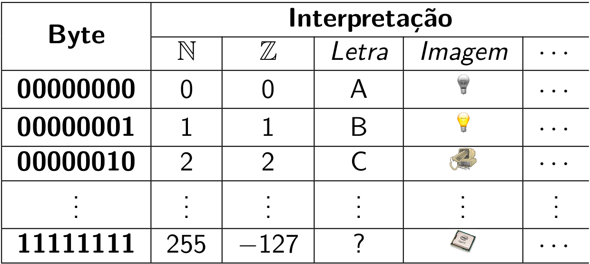

## Linguagem de Programação

!!! info "Programação / Linguagem de programação"

    Programação é o processo de transformar o algoritmo em instruções em uma linguagem de programação, que permite a formulação de instruções a um computador. A linguagem de programação é um conjunto de termos (vocabulário) e regras (sintaxe) que permite a formulação de instruções para um computador.

Toda linguagem de programação é baseada em instruções *primitivas*, as entidades mais simples que ela trata; em *formas de combinação* destes elementos simples, e em *formas de abstração* destas combinações de modo que possam também ser consideradas como primitivas[@Abelson1996]. Por exemplo, pode-se combinar muitas instruções primitivas necessárias para exibir uma mensagem na saída padrão de tal forma que este processo seja fácil e intuitivamente obtido por uma nova primitiva: `print`.

[Alan Turing](http://pt.wikipedia.org/wiki/Alan_Turing) mostrou que 6 primitivas são suficientes para computar qualquer coisa [computável]. Assim, uma linguagem de programação [[*Turing-completa*](http://pt.wikipedia.org/wiki/Turing_completude)] define tanto a [sintaxe](http://pt.wikipedia.org/wiki/Sintaxe_%28l%C3%B3gica%29) quanto a [semântica](http://pt.wikipedia.org/wiki/Sem%C3%A2ntica) necessárias para traduzir o pensamento computacional em passos que um computador pode executar.

As linguagens modernas têm um conjunto maior e mais conveniente de primitivas que as 6 de Turing, e permitem que você as agrupe para elaborar programas mais complexos. Estas novas abstrações também podem ser agrupadas, e assim sucessivamente. Por exemplo, as primitivas mais comuns são: números ($1$, $-2$, $3.14$), símbolos ("@", "Alan M. Turing", ":)"), e operações simples ($+$, $-$, $\times$, $\div$).

A sintaxe da linguagem indica quais expressões são simbolicamente corretas (`1 + 1`), ou não (`João ÷ `). A semântica lida com o significado associado a uma expressão sintaticamente correta, que pode ser logicamente correto (`dois = 1 + 1`) ou não (`area_do_quadrado = lado + lado`). Erros sintáticos são relativamente fáceis de se encontrar, mas o mesmo não pode ser dito sobre erros semânticos.

A **linguagem de máquina** é a que o hardware [específico] entende (código binário). A vantagem é que não é preciso gastar esforços traduzindo instruções, mas é praticamente incompreensível para humanos [normais].

Uma **linguagem de baixo nível** usa [instruções mnemônicas](http://pt.wikipedia.org/wiki/Assembly) para tentar facilitar a programação. A vantagem é ser muito mais inteligível que a de máquina, mas também é pouco amigável e, dependendo do hardware utilizado, precisa ser traduzida para linguagem de máquina.

Já uma **linguagem de alto nível** usa um vocabulário mais rico para facilitar programação. É "facilmente" aprendida e independente do hardware, mas precisa ser traduzida para linguagem de máquina. As linguagens de alto nível claramente possibilitam programas mais breves e legíveis, mas o fazem pela composição e abstração das primitivas da máquina. Conhecendo uma linguagem de programação, pode-se elaborar programas bem interessantes.

O exemplo tradicional é o "[Olá mundo!](http://pt.wikipedia.org/wiki/Programa_Ol%C3%A1_Mundo)".

=== "Python"

    ``` py title="Olá mundo!"
    --8<-- "ola_mundo.py"
    ```

=== "Rust"

    ``` Rust title="Olá mundo!"
    --8<-- "ola_mundo.rs"
    ```

=== "C"

    ``` c title="Olá mundo!"
    --8<-- "ola_mundo.c"
    ```

=== "Assembly"

    ``` x86asm title="Olá mundo!"
    --8<-- "ola_mundo.asm"
    ```

=== "Código Binário"

    ``` title="Olá mundo!"
    --8<-- "ola_mundo.bin::8"
    (continua por mais 2120 linhas)
    ```

!!! note

    Compreender os fundamentos e técnicas de programação é mais importante que dominar uma linguagem específica.

Havendo um programa sintaticamente correto, é preciso traduzi-lo da linguagem de alto nível para a linguagem de máquina para que haja instruções que o computador usado consiga interpretar (cada dispositivo fala sua própria linguagem). Neste processo, o código fonte é *verificado* para garantir que não contém erros sintáticos. Dependendo da implementação da linguagem, este código é *compilado*, gerando um *[objeto](http://pt.wikipedia.org/wiki/C%C3%B3digo_objeto)* (a versão das instruções originais em binário) que, por sua vez, é interpretado por um programa gerando um arquivo que pode ser executado.

Qualquer linguagem de programação pode ser interpretada ou compilada, estas são formas de *implementação* (e não características da linguagem) que não são, necessariamente, exclusivas. A *interpretação* é realizada por um programa específico (o interpretador) que realiza as instruções pelo programa sendo interpretado de modo que este seja executado. Imagine que, a cada passo, uma instrução é interpretada e executada. Já a *compilação* (realizada pelo programa compilador) traduz completamente o programa original em código objeto que pode ser executado pela máquina.

A interpretação tende a ser mais portátil, e tem a "vantagem" de realizar um passo de cada vez, já a compilação pode a gerar código otimizado e que não precisa ser interpretado a cada instrução. Outra diferença é que interpretadores são mais simples de se construir que compiladores.

Existem diversas ferramentas para realizar este processo, como o compilador [GCC](http://pt.wikipedia.org/wiki/GNU_Compiler_Collection) para linguagem C ou o interpretador Python 3. No caso do exemplo abaixo, supondo que se esteja no diretório do arquivo com código fonte, bastaria executar na linha de comando:

=== "Python"

    ``` bash title="Olá mundo!"
    $ python ola_mundo.py
    ```

=== "C"

    ``` bash title="Olá mundo!"
    $ gcc ola_mundo.c -o ola_mundo
    $ ./ola_mundo
    ```

# Conceitos Básicos

A execução do programa passa pela interpretação das instruções apresentadas. Uma *instrução* `<instr>` é um comando sintaticamente correto que pode ser diretamente executado. Já uma *expressão* `<expr>` é uma instrução que precisa ser interpretada e que produz um resultado (que pode ser armazenado). Por exemplo, ao interagir com um agente humano como executor do algoritmo, ele entende a instrução `<Levante>` e a realiza, mas não há uma informação produzida como resultado disto. Em seguida, podemos passar a expressão `<Fale seu nome>`, cujos termos precisam ser analisados e interpretados no contexto para que o agente possa reconhecer quem deve executar (o próprio agente), qual a ação  a ser executada (falar) e sobre o que ela deve executar (o nome) - só então ele pode executar o que foi solicitado e produzir uma nova informação (o nome falado), que se pode ser armazenado (ou não) para uma necessidade futura.

Uma expressão pode ser composta por apenas um valor, como `<Pedro>` ou `<42>`, e também por diferentes valores e operadores. A expressão `2 + 3` produz o resultado 5 ao ser executada.


=== "Instruções"

    ``` python title="Python"
    pass
    ```

=== "Expressões"

    ``` python title="Python"
    >>> 21 * 2
    42
    >>> 20 - (2 ** 3 - 1)
    7
    >>> -1 + (-4 * 2.5 + 3 / 2)
    -9.5
    ```

<h2>Tipo de Dado</h2>

Todo processo no computador gerencia a execução de um programa armazenado, a implementação de um algoritmo computacional nãos sendo, portanto, possível dissociar um algoritmo de dados manipulados - o próprio programa é um conjunto de dados (as instruções). Além disso, praticamente todos os programas manipulam dados fornecidos e gerados no processamento, na forma de variáveis ou constantes, que são os objetos de dados básicos manipulados em um programa[@Kernighan1989].

Ao executar um algoritmo computacional, estamos exigindo esforço da máquina para realizar o trabalho de processamento. Este esforço depende da quantidade de instruções sendo executadas, e do custo de cada instruções (podemos ter instruções mais simples e baratas, e instruções mais complexas e caras). A organização dos dados tem impacto direto neste esforço, e buscamos deixá-los organizados de forma a tornar o processo menos custoso. Por exemplo, imagine que seu problema é interpretar números e somá-los, é muito mais fácil[^1] fazer isso se lhe forem apresentados os números estruturados como $49$ e $1$ (com resultado $50$) que se fossem como $XLIX$ e $I$ (também com resultado $L$).

A memória do computador é um conjunto ordenado de bits, ou seja, toda informação é armazenada como zeros e uns e há uma ordem posicional entre eles (existe um primeiro bit, que pode ser `0/1`, um segundo bit que também pode ser `0/1`, e assim sucessivamente até um último bit). Para facilitar, há uma [nomenclatura específica](http://pt.wikipedia.org/wiki/Byte) para lidar com a quantidade de bits sendo 1 byte (8 bits) a unidade mais comum para quantificá-lo. A composição de bits permite representar mais estados; 2 bits são 4 estados (`00/01/11/10`), 3 bits definem 8 estados, e assim sucessivamente - havendo $n$ bits podemos definir $2^n$ estados distintos. O significado da informação armazenada depende da forma de interpretar estes bits, um mesmo conjunto de bits tem significados diferentes se for interpretado como um número, um símbolo ou outra coisa. Por exemplo, um byte pode assumir um de 256 valores numéricos diferentes, mas também pode representar inúmeras informações diferentes se mudarmos a forma de interpretá-lo.

{ width="75%" }

A representação do dado é necessariamente binária mas a interpretação dos bits é o que define a informação. Esta interpretação é determinada pelo *tipo de dado*, e cada tipo tem suas características específicas definidas pela linguagem de programação. Por exemplo, o conjunto de bits `01000001001000000000000000000000` pode ser interpretado como o valor numérico do tipo inteiro 1092616192, como o valor numérico do tipo real 10.0 ou como um tipo simbólico `A` ([ASCII](https://pt.wikipedia.org/wiki/ascii)). Estes três tipos de dados, entre outros, geralmente estão presentes em qualquer linguagem de programação.

!!! note

    Como um mesmo conjunto de bits pode ser interpretado de diferentes formas, é necessário saber que tipo de dado foi armazenado na memória para interpretá-lo corretamente.

Um *tipo abstrato de dado* (TAD) determina um tipo de dado e as operações definidas sobre ele, delimitando assim a quantidade de informação necessária para manipulação dos valores pelo computador e, consequentemente, facilitando a programação. Um exemplo de TAD é o conjunto de números naturais $\mathbb{N}$ e suas operações aritméticas $+, -, /, *$).

!!! info "Estrutura de Dados"

    Forma concreta de se implementar um tipo abstrato de dados em uma linguagem de programação, de modo a organizar os dados na memória para facilitar o acesso e a manipulação destes.

Portanto, para cada linguagem de programação específica, o tipo do dado determina:

1. o significado do valor armazenado;
1. como o valor é armazenado nos bits;
1. quais os possíveis valores que podem ser armazenados; e
1. quais as operações podem ser realizadas com o valor.

!!! note

    As características de uma estrutura de dados específica são importantes pois determinam o que pode e também o que **não** pode ser feito com ela.

<h2>Exercícios</h2>

??? question "Dado um número não negativo qualquer na base hexadecimal, descreva o algoritmos para transformá-lo em um número binário."

    Como a base 16 é múltipla de 2, o processo manual é bem simples. Cada algarismo hexadecimal pode ser diretamente mapeado para seu valor binário de 4 bits, na mesma ordem. Por exemplo, para $2A_{16}$ temos que $2_{16} \rightarrow 0010_2$ e $A_{16} \rightarrow 1010_2$, portanto $2A_{16}\rightarrow 00101010_2$.

[^1]: Exceto se você for um antigo romano...


!!! info "Constante"
    Uma *constante* `<C>` é um valor armazenado que não é alterado no decorrer do processamento.

!!! info "Variável"
    Uma *variável* `<v>` é um valor armazenado que pode ser alterado no decorrer do processamento.

=== "Constantes"

    ``` python title="Python"
    >>> math.pi
    3.141592653589793
    ```

=== "Variáveis"

    ``` python title="Python"
    >>> y = 13
    >>> x = 42
    >>> y = 123  # o valor de x não foi alterado, mas o de y sim.
    ```

Variáveis e constantes exigem um pouco mais de